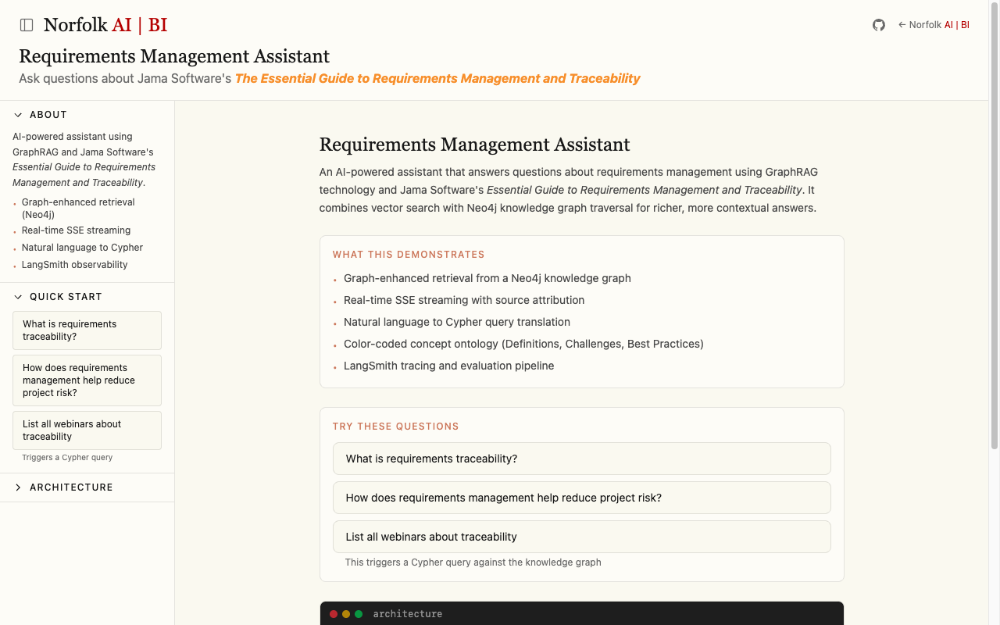
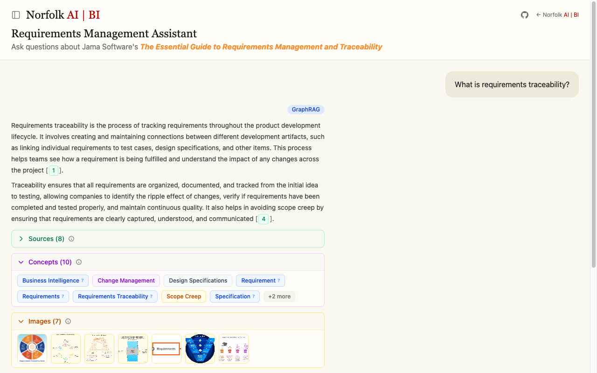
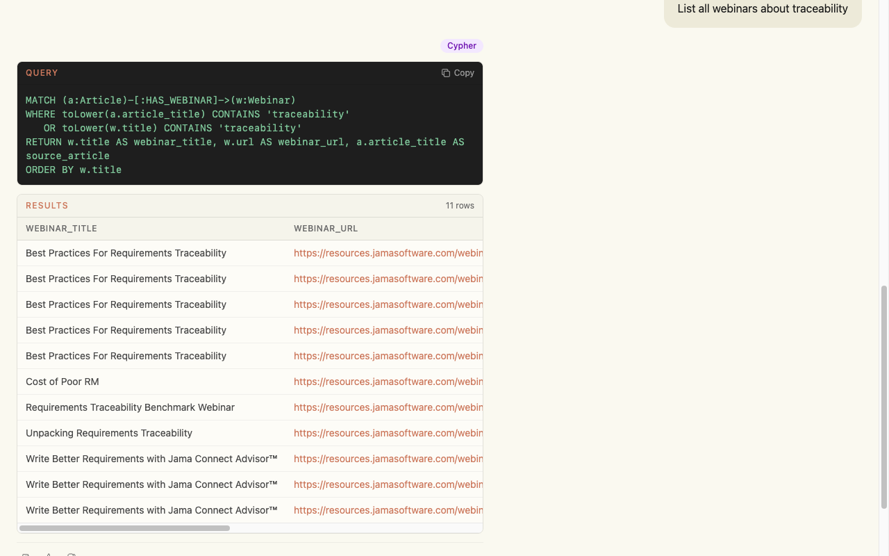

[](https://github.com/arthurfantaci/requirements-graphrag-api/actions/workflows/ci.yml)
[](https://codecov.io/gh/arthurfantaci/requirements-graphrag-api)
[](LICENSE)
[](https://www.python.org/downloads/)
[](https://react.dev/)

# Requirements GraphRAG API

A **Graph-Enriched Retrieval-Augmented Generation** (GraphRAG) system with a chat interface for the [Jama Software "Essential Guide to Requirements Management and Traceability"](https://www.jamasoftware.com/requirements-management-guide) knowledge base. Features an **agentic RAG architecture** built on LangGraph with autonomous tool selection, multi-hop reasoning, and self-critique capabilities. Includes a 4-level graph enrichment pipeline, automatic query routing, SSE streaming with progressive metadata, conversation persistence, and end-to-end LangSmith observability with comprehensive evaluation.

## Live Demo

| | URL |
|---|---|
| **Chat Interface** | [graphrag.norfolkaibi.com](https://graphrag.norfolkaibi.com) |
| **Swagger API Docs** | [graphrag-api.norfolkaibi.com/docs](https://graphrag-api.norfolkaibi.com/docs) |

## Screenshots



<details>
<summary><strong>GraphRAG explanatory response</strong> — intent badge, citations, entity concepts, media gallery</summary>



</details>

<details>
<summary><strong>Text2Cypher structured response</strong> — generated Cypher query with tabular results</summary>



</details>

## Features

### Graph-Enriched RAG Pipeline

Every query passes through a multi-stage enrichment pipeline that progressively adds context from the Neo4j knowledge graph:

| Level | Enrichment | What it adds |
|-------|-----------|-------------|
| 1 | **Window Expansion** | Adjacent chunk text via `NEXT_CHUNK` relationships for narrative continuity |
| 2 | **Entity Extraction** | Entities `MENTIONED_IN` chunks with properties: name, type, definition, benefit, impact |
| 3 | **Semantic Traversal** | Related entities via `RELATED_TO`, `ADDRESSES`, `REQUIRES`, `COMPONENT_OF` relationships |
| 4 | **Domain Context** | Industry standards, images, webinars, videos, cross-references, and glossary definitions |

### Automatic Query Routing

A two-stage classifier routes each query to the appropriate handler:

- **Stage 1 — Keyword matching**: Frozen set of structured triggers (`"list all"`, `"how many"`, `"count"`, `"table of"`) plus regex patterns for instant classification
- **Stage 2 — LLM classification**: For ambiguous queries, an LLM classifier (temperature 0) returns `{"intent": "structured" | "explanatory"}`

| Intent | Handler | Output |
|--------|---------|--------|
| **Explanatory** | Agentic RAG with autonomous tool selection + graph enrichment | Streamed prose with citations, entities, media |
| **Structured** | Text2Cypher — natural language translated to a Cypher query | Generated query + tabular results |

### Agentic RAG Architecture

Built on **LangGraph**, the agentic system autonomously orchestrates retrieval and synthesis:

```
┌─────────────────────────────────────────────────────────────────┐
│                      AGENTIC ORCHESTRATOR                        │
│  ┌──────────┐    ┌──────────┐    ┌──────────┐    ┌──────────┐  │
│  │   RAG    │───▶│ Research │───▶│Synthesis │───▶│  Output  │  │
│  │ Subgraph │    │ Subgraph │    │ Subgraph │    │          │  │
│  └──────────┘    └──────────┘    └──────────┘    └──────────┘  │
│       │               │               │                         │
│       ▼               ▼               ▼                         │
│  Query Expansion  Entity        Self-Critique                   │
│  Parallel Search  Exploration   Revision Loop                   │
└─────────────────────────────────────────────────────────────────┘
```

| Subgraph | Nodes | Capability |
|----------|-------|------------|
| **RAG** | expand_queries → parallel_retrieve → dedupe_rank | Multi-query expansion with step-back reasoning |
| **Research** | identify_entities → explore_entity (loop) | Deep entity exploration with conditional iteration |
| **Synthesis** | draft_answer → critique → revise → format | Self-critique with automatic revision |

**Key Features:**
- **7 Agent Tools**: graph_search, text2cypher, explore_entity, lookup_standard, search_definitions, lookup_term, get_webinars
- **Conversation Persistence**: PostgresSaver for multi-turn conversations with thread isolation
- **Self-Critique**: CRITIC prompt evaluates answer completeness and triggers revision if needed
- **Performance Tracking**: Built-in metrics for subgraph execution times and optimization hints
- **Cost Analysis**: LLM token tracking with per-model cost estimation

### SSE Streaming Chat

Responses stream over Server-Sent Events with progressive metadata delivery:

```
Explanatory:  routing → sources → token (repeated) → done
Structured:   routing → cypher → results → done
```

Each event carries typed JSON payloads (`StreamEventType` StrEnum with 7 values: `ROUTING`, `SOURCES`, `TOKEN`, `CYPHER`, `RESULTS`, `DONE`, `ERROR`). The frontend consumes these via a custom `useSSEChat` React hook.

### Additional Capabilities

- **Search modes** — Vector similarity, hybrid (vector + full-text with adjustable weights), and graph-enriched search endpoints
- **Glossary & definitions** — Fuzzy-matched term lookup from the knowledge graph
- **Industry standards** — Queryable standards filtered by industry (automotive, medical, aerospace, defense, rail)
- **Schema explorer** — Node labels, relationships, and counts; per-entity relationship maps
- **User feedback** — Score + category + correction, correlated with LangSmith run IDs
- **Tiered evaluation** — Automated benchmark on release tags (Tier 3) and nightly deep evaluation (Tier 4) via GitHub Actions

## Architecture

```
┌──────────────────────┐
│   React 19 + Vite    │
│   Tailwind CSS v4    │
│   (Vercel)           │
└──────────┬───────────┘
           │ SSE / REST
           ▼
┌──────────────────────────────────────┐
│   FastAPI + Agentic Orchestrator     │
│   (LangGraph StateGraph)             │
│   ├─ Query Router                    │──── LangSmith Tracing
│   ├─ Tool Selection                  │
│   └─ Self-Critique Loop              │
│   (Railway)                          │
└──────┬───────┬───────────────────────┘
       │       │              │
       ▼       ▼              ▼
  ┌─────────┐ ┌────────────┐ ┌──────────────┐
  │ Agentic │ │ Text2Cypher│ │  PostgreSQL  │
  │   RAG   │ │  (LLM →    │ │  Checkpoints │
  │Subgraphs│ │   Cypher)  │ │ (Persistence)│
  └────┬────┘ └──────┬─────┘ └──────────────┘
       │             │
       ▼             ▼
┌──────────────────────┐
│   Neo4j AuraDB       │
│   Knowledge Graph    │
│   (Chunks, Entities, │
│    Media, Standards) │
└──────────────────────┘
```

## Tech Stack

| Layer | Technology | Purpose |
|-------|-----------|---------|
| Frontend | React 19, Vite 7, Tailwind CSS 4 | Chat UI with SSE streaming, entity badges, media galleries |
| Backend | FastAPI, Python 3.12+, uv | REST API with SSE endpoints, async I/O |
| Graph Database | Neo4j AuraDB, neo4j-graphrag | Knowledge graph storage, vector index, Cypher queries |
| LLM | OpenAI GPT-4o, text-embedding-3-small | Answer generation, intent classification, embeddings |
| Agentic Orchestration | LangGraph, langgraph-checkpoint-postgres | Stateful agent graphs, subgraph composition, conversation persistence |
| Chain Composition | LangChain Core, langchain-openai | RAG chain building, prompt management |
| Observability | LangSmith | Tracing, feedback, prompt versioning, evaluation |
| CI/CD | GitHub Actions, Codecov | Lint, test, coverage, evaluation, prompt sync |
| Deployment | Railway (backend), Vercel (frontend) | Docker containers, edge CDN |

## API Endpoints

| Method | Path | Description |
|--------|------|-------------|
| `POST` | `/chat` | SSE streaming chat with automatic intent routing |
| `GET` | `/chat/{thread_id}` | Retrieve conversation state by thread ID |
| `POST` | `/chat/{thread_id}/continue` | Continue an existing conversation thread |
| `GET` | `/chat/routing-guide` | User-facing documentation for query routing |
| `POST` | `/search/vector` | Semantic vector similarity search |
| `POST` | `/search/hybrid` | Vector + keyword search with adjustable weights |
| `POST` | `/search/graph` | Multi-level graph-enriched search |
| `GET` | `/definitions/{term}` | Look up a specific glossary term (fuzzy match) |
| `GET` | `/definitions` | List or search all glossary terms |
| `GET` | `/standards/{name}` | Look up a specific industry standard |
| `GET` | `/standards` | List or search standards with optional industry filter |
| `GET` | `/schema` | Node labels, relationships, and counts |
| `GET` | `/schema/entity/{name}` | Explore entity with its relationships |
| `POST` | `/feedback` | Submit response feedback (score, category, correction) |
| `GET` | `/health` | Health check with Neo4j connectivity status |

## Knowledge Graph

### Node Types

| Category | Labels | Key Properties |
|----------|--------|---------------|
| **Content** | `Chunk`, `Article`, `Definition` | text, article_title, url, term, definition |
| **Domain Entities** | `Concept`, `Challenge`, `Bestpractice`, `Standard`, `Methodology`, `Artifact`, `Tool`, `Role`, `Processstage`, `Industry` | name, display_name, definition, benefit, impact |
| **Media** | `Image`, `Webinar`, `Video` | title, url, alt_text, thumbnail_url |

### Relationships

| Relationship | Direction | Purpose |
|-------------|-----------|---------|
| `FROM_ARTICLE` | Chunk → Article | Provenance |
| `NEXT_CHUNK` | Chunk → Chunk | Sequential ordering (window expansion) |
| `MENTIONED_IN` | Entity → Chunk | Entity extraction |
| `RELATED_TO` | Entity → Entity | Cross-domain connections |
| `ADDRESSES` | Entity → Entity | Challenge resolution |
| `REQUIRES` | Entity → Entity | Dependencies |
| `COMPONENT_OF` | Entity → Entity | Part-whole |
| `APPLIES_TO` | Standard → Industry | Industry applicability |
| `HAS_IMAGE` / `HAS_WEBINAR` / `HAS_VIDEO` | Article → Media | Media enrichment |
| `REFERENCES` | Article → Article | Cross-references |

### Entity Color Coding

The frontend displays color-coded badges for knowledge graph entities:

| Entity Type | Color | Examples |
|------------|-------|---------|
| Concept | Grey | Requirements Traceability, Business Intelligence |
| Challenge | Red | Scope Creep, Requirements Volatility |
| Best Practice | Green | Change Management, Continuous Verification |
| Artifact | Blue | Design Specifications, Test Cases |
| Standard | Purple | ISO 13485, DO-178C |

## Quick Start

### Docker (recommended)

```bash
# Clone and configure
git clone https://github.com/arthurfantaci/requirements-graphrag-api.git
cd requirements-graphrag-api
cp .env.example .env
# Edit .env with your Neo4j, OpenAI, and LangSmith credentials

# Start both services
docker-compose up

# Backend API: http://localhost:8000
# Frontend:    http://localhost:5173
# API Docs:    http://localhost:8000/docs
```

### Without Docker

```bash
# Backend
cd backend
uv sync --extra dev
uv run uvicorn requirements_graphrag_api.api:app --reload

# Frontend (new terminal)
cd frontend
npm install
npm run dev
```

## Deployment

| Platform | Service | URL | Config |
|----------|---------|-----|--------|
| Railway | Backend API | [graphrag-api.norfolkaibi.com](https://graphrag-api.norfolkaibi.com) | `railway.toml`, `backend/Dockerfile` |
| Vercel | Frontend | [graphrag.norfolkaibi.com](https://graphrag.norfolkaibi.com) | `frontend/vercel.json` |
| Neo4j AuraDB | Graph Database | — | `neo4j+s://` URI in env vars |

## CI/CD & Evaluation

| Workflow | Trigger | What it does |
|----------|---------|-------------|
| **CI** (`ci.yml`) | Push to main/develop, PRs | Ruff lint + format check, pytest with coverage, Codecov upload |
| **Evaluation** (`evaluation.yml`) | Release tags, nightly schedule, manual | Tier 3 full benchmark on releases; Tier 4 deep evaluation nightly (auto-creates GitHub issues on failure) |
| **Sync Prompts** (`sync-prompts.yml`) | Push to main (prompt files), manual | Pushes versioned prompts to LangSmith Hub |
| **Deploy** (`deploy.yml`) | Manual dispatch | Manual Vercel deployment (disabled — Vercel GitHub integration handles auto-deploy) |

## Environment Variables

See [`backend/.env.example`](backend/.env.example) for the full template with inline documentation.

| Variable | Required | Default | Description |
|----------|----------|---------|-------------|
| `NEO4J_URI` | Yes | — | Neo4j connection URI (`neo4j+s://` for production) |
| `NEO4J_USERNAME` | Yes | — | Neo4j username |
| `NEO4J_PASSWORD` | Yes | — | Neo4j password |
| `NEO4J_DATABASE` | No | `neo4j` | Neo4j database name |
| `OPENAI_API_KEY` | Yes | — | OpenAI API key |
| `OPENAI_MODEL` | No | `gpt-4o` | LLM model for generation and classification |
| `EMBEDDING_MODEL` | No | `text-embedding-3-small` | Embedding model (must match index) |
| `VECTOR_INDEX_NAME` | No | `chunk_embeddings` | Neo4j vector index name |
| `SIMILARITY_K` | No | `6` | Number of similar chunks to retrieve |
| `NEO4J_MAX_POOL_SIZE` | No | `5` | Connection pool size (small for serverless) |
| `NEO4J_CONNECTION_TIMEOUT` | No | `30.0` | Connection timeout in seconds |
| `LANGSMITH_TRACING` | No | `false` | Enable LangSmith tracing |
| `LANGSMITH_API_KEY` | No | — | LangSmith API key |
| `LANGSMITH_PROJECT` | No | `graphrag-api-dev` | LangSmith project name |
| `CHECKPOINT_DATABASE_URL` | No | — | PostgreSQL URL for conversation persistence (LangGraph checkpoints) |
| `CORS_ORIGINS` | No | `localhost:3000,5173` | Allowed CORS origins (comma-separated) |
| `VITE_API_URL` | Yes (frontend) | — | Backend API URL for the frontend |

## Project Structure

```
requirements-graphrag-api/
├── .github/workflows/
│   ├── ci.yml                          # Lint + test + coverage
│   ├── evaluation.yml                  # Tiered evaluation (release + nightly)
│   ├── sync-prompts.yml                # LangSmith Hub prompt sync
│   └── deploy.yml                      # Manual Vercel deploy
│
├── backend/
│   ├── src/requirements_graphrag_api/
│   │   ├── api.py                      # FastAPI app with lifespan (driver init)
│   │   ├── config.py                   # AppConfig with env validation
│   │   ├── neo4j_client.py             # Driver creation helpers
│   │   ├── observability.py            # LangSmith tracing setup
│   │   ├── exceptions.py               # Custom exception hierarchy
│   │   ├── core/
│   │   │   ├── retrieval.py            # Vector/hybrid/graph search + 4-level enrichment
│   │   │   ├── generation.py           # RAG answer generation + SSE streaming
│   │   │   ├── routing.py              # Intent classification (keyword + LLM)
│   │   │   ├── text2cypher.py          # Natural language → Cypher translation
│   │   │   ├── definitions.py          # Glossary/definition lookup
│   │   │   ├── standards.py            # Industry standards queries
│   │   │   └── agentic/                # LangGraph agentic orchestration
│   │   │       ├── state.py            # TypedDict state definitions
│   │   │       ├── tools.py            # Agent tool definitions (7 tools)
│   │   │       ├── orchestrator.py     # Main composed graph with routing
│   │   │       ├── checkpoints.py      # PostgresSaver configuration
│   │   │       ├── streaming.py        # SSE streaming utilities
│   │   │       └── subgraphs/          # RAG, Research, Synthesis subgraphs
│   │   ├── routes/
│   │   │   ├── chat.py                 # /chat SSE endpoint
│   │   │   ├── search.py              # /search/vector|hybrid|graph
│   │   │   ├── definitions.py          # /definitions, /glossary
│   │   │   ├── standards.py            # /standards
│   │   │   ├── schema.py              # /schema
│   │   │   ├── feedback.py             # /feedback (LangSmith integration)
│   │   │   └── health.py              # /health
│   │   ├── prompts/
│   │   │   ├── catalog.py              # PromptCatalog with Hub caching
│   │   │   └── definitions.py          # Prompt text + Text2Cypher examples
│   │   └── evaluation/
│   │       ├── __init__.py             # Exports all evaluation utilities
│   │       ├── agentic_evaluators.py   # LangSmith evaluators for agentic RAG
│   │       ├── performance.py          # Subgraph performance tracking
│   │       ├── cost_analysis.py        # LLM cost tracking and estimation
│   │       ├── metrics.py              # Standard RAG evaluation metrics
│   │       └── domain_metrics.py       # Domain-specific metrics
│   ├── tests/                          # pytest suite (unit + integration)
│   ├── Dockerfile                      # Production container (Python 3.12)
│   └── pyproject.toml                  # Dependencies, Ruff, pytest config
│
├── frontend/
│   ├── src/
│   │   ├── App.jsx                     # Main layout (header, sidebar, chat)
│   │   ├── hooks/useSSEChat.js         # SSE streaming hook
│   │   └── components/
│   │       ├── chat/                   # MessageList, ChatInput, AssistantMessage
│   │       ├── metadata/              # EntityBadges, CypherDisplay, ResultsTable
│   │       ├── feedback/              # FeedbackBar, FeedbackModal
│   │       └── sidebar/               # Sidebar, quick-start templates
│   ├── Dockerfile                      # Dev/prod Node container
│   └── package.json                    # React 19, Vite 7, Tailwind 4
│
├── docker-compose.yml                  # Local dev: backend + frontend
├── railway.toml                        # Railway deployment config
└── LICENSE                             # MIT
```

## License

[MIT](LICENSE)
