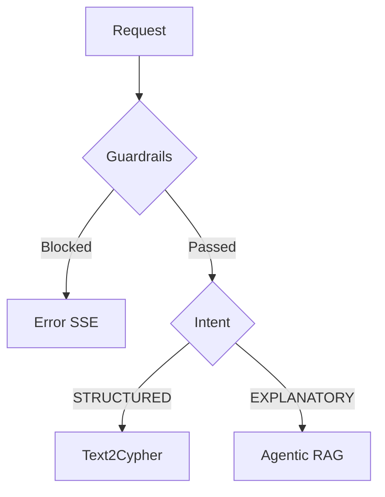

# Developer Workflow Guide

> **Purpose**: Standardized workflows for planning, reviewing, and implementing features.
> **Audience**: Arthur (and future contributors) building muscle memory for professional AI engineering.
> **Last Updated**: 2026-02-06

---

## 1. Tool Installation Reference

### Diagramming Tools

| Tool | Scope | Install | Why |
|------|-------|---------|-----|
| **Mermaid CLI** (`mmdc`) | Global | `npm install -g @mermaid-js/mermaid-cli` | GitHub renders Mermaid natively in Markdown. Industry standard for docs-as-code. |
| **D2** | Global | `brew install d2` | Modern declarative diagrams. Better than Mermaid for complex architecture views. Growing fast in industry. |
| **Mermaid Chart MCP** | Claude Code | Already configured in VSCode | Claude can generate AND validate Mermaid diagrams during planning sessions. |

### Static Analysis Tools

| Tool | Scope | Install | Why |
|------|-------|---------|-----|
| **mypy** | Project | `uv add --dev mypy` | Static type checking. Catches type bugs like `TopicGuardResult` vs `TopicCheckResult` before runtime. |
| **radon** | Project | `uv add --dev radon` | Cyclomatic complexity analysis. Quantifies God Function complexity (objective evidence for refactoring). |
| **vulture** | Project | `uv add --dev vulture` | Dead code detection. Finds unused functions, variables, imports. |
| **ruff** | Project | Already installed | Linting + formatting (replaces flake8, black, isort). |
| **pytest** | Project | Already installed | Test runner. |

### Observability & Data Tools

| Tool | Scope | Purpose |
|------|-------|---------|
| **LangSmith MCP** | Claude Code (project) | Production trace analysis, feedback capture, evaluation datasets |
| **Neo4j MCP** | Claude Code (project) | Direct read-only graph database queries during development |
| **Context7 MCP** | Claude Code (plugin) | Fetch up-to-date library documentation during planning |
| **LangChain Docs MCP** | Claude Code (cloud) | Search LangSmith/LangChain/LangGraph docs |
| **Playwright MCP** | Claude Code (plugin) | Browser automation for SSE testing and CLS measurement |
| **Mermaid Chart MCP** | Claude Code (cloud) | Validate and render Mermaid diagrams |

### Claude Code Plugins

| Plugin | Category | What It Provides |
|--------|----------|-----------------|
| **security-guidance** | Safety | PreToolUse hook that warns about injection, XSS, OWASP patterns on file edits |
| **commit-commands** | Git workflow | `/commit`, `/commit-push-pr`, `/clean_gone` commands |
| **hookify** | Enforcement | Create custom behavior rules (e.g., "never commit API keys") via `/hookify` |
| **code-review** | Quality | Multi-agent PR review with confidence-based scoring |
| **pr-review-toolkit** | Quality | Specialized agents: silent-failure-hunter, type-design-analyzer, pr-test-analyzer, comment-analyzer |
| **code-simplifier** | Refactoring | Agent that simplifies code for clarity and maintainability |
| **feature-dev** | Development | Structured feature workflow: code-explorer, code-architect, code-reviewer agents |
| **claude-md-management** | Memory | `/revise-claude-md` to capture session learnings |
| **explanatory-output-style** | Learning | Educational insights about implementation choices |
| **pyright-lsp** | Python | Static type checking and code intelligence |
| **context7** | Docs | Up-to-date library documentation lookup |
| **playwright** | Testing | Browser automation (SSE, CLS, screenshots) |
| **github** | Integration | GitHub MCP for repo/issue/PR management |

### Scope Legend

- **Global**: Installed system-wide via Homebrew or npm. Available in any project's terminal.
- **Project**: Installed in `pyproject.toml` `[dev]` group via `uv add --dev`. Only available when `uv run` is used in this project.
- **Claude Code (plugin)**: Plugin enabled in `~/.claude/settings.json`. Available to Claude across all projects.
- **Claude Code (project)**: MCP server configured in `.mcp.json`. Available to Claude in this project only.
- **Claude Code (cloud)**: Anthropic-hosted MCP server. Available to Claude automatically.

---

## 2. The Plan-Review-Implement Cycle

This is the core workflow. Practice it until it's muscle memory.

### Phase 1: Plan (30% of time)

```
1. Identify the problem
   - Read the relevant code (don't guess)
   - Check MEMORY.md for prior context
   - Check docs/ for existing analysis

2. Write the plan
   - Create a Markdown file in docs/ (plans survive sessions)
   - Include: Problem, Implementation steps, Tests, Verification
   - Include line numbers and file paths (precision matters)

3. Generate architecture diagrams
   - Mermaid for flowcharts and sequence diagrams (inline in Markdown)
   - D2 for complex architecture views (separate .d2 files)

4. Commit the plan (docs: add <feature> implementation plan)
```

### Phase 2: Review (20% of time)

```
1. Sub-agent review
   - Launch a code-architect or general-purpose agent
   - Give it the plan file path + all relevant source files
   - Instruct it to validate: line numbers, API usage, edge cases

2. Static analysis (run before any code changes)
   uv run mypy src/                    # Type errors
   uv run radon cc src/ -a -nc         # Complexity (target: A or B)
   uv run vulture src/                 # Dead code

3. Synthesize findings
   - Cross-reference agent findings against docs (Context7, LangChain MCP)
   - Rate each issue: P0 (must fix) / P1 (should fix) / P2 (nice to have)
   - Apply fixes to the plan document

4. Re-review if P0 issues were found (iterate until clean)
```

### Phase 3: Implement (40% of time)

```
1. Create feature branch
   git checkout -b fix/phase-a-readiness

2. Implement one commit at a time (follow plan's commit sequence)
   - Write tests FIRST (TDD)
   - Implement the change
   - Run the full check suite:
     uv run ruff check src/
     uv run mypy src/
     uv run pytest
   - Commit with conventional message

3. Run specialized review agents after each commit:
   - pr-review-toolkit:silent-failure-hunter (error handling)
   - pr-review-toolkit:type-design-analyzer (new types)
   - pr-review-toolkit:pr-test-analyzer (test coverage)

4. Generate post-implementation diagrams
   - Update architecture diagrams if structure changed
   - Add sequence diagrams for new SSE event flows
```

### Phase 4: Finalize (10% of time)

```
1. Create PR with full review
   - pr-review-toolkit:review-pr (comprehensive)
   - pr-review-toolkit:comment-analyzer (documentation quality)

2. Update memory files
   - /memory-hygiene (Claude skill)
   - /claude-md-management:revise-claude-md

3. Update DEV_WORKFLOW.md if new patterns discovered
```

---

## 3. Diagramming Workflow

### Mermaid (for GitHub-rendered docs)

Write Mermaid directly in Markdown files. GitHub renders it automatically.

````markdown

````

**CLI rendering** (for local preview or PDF export):
```bash
mmdc -i diagram.mmd -o diagram.png           # PNG output
mmdc -i diagram.mmd -o diagram.svg           # SVG output
mmdc -i diagram.mmd -o diagram.pdf           # PDF output
```

**When to use Mermaid:**
- Flowcharts in README/docs (GitHub renders inline)
- Sequence diagrams for SSE event flows
- Simple dependency graphs
- Any diagram that should be visible in GitHub PR reviews

### D2 (for complex architecture diagrams)

Create `.d2` files for architecture views that are too complex for Mermaid.

```bash
d2 architecture.d2 architecture.svg           # Render SVG
d2 architecture.d2 architecture.png           # Render PNG
d2 --watch architecture.d2 architecture.svg   # Live reload while editing
d2 --layout elk architecture.d2 out.svg       # Use ELK layout engine
```

**When to use D2:**
- System architecture diagrams (multiple services, databases, APIs)
- Complex data flow diagrams with many connections
- Diagrams where you need fine-grained styling control
- Diagrams you want to look polished for portfolio presentations

### Diagram File Organization

```
docs/
├── diagrams/
│   ├── guardrail-pipeline.mmd      # Mermaid source
│   ├── sse-event-sequence.mmd      # Mermaid source
│   ├── architecture-overview.d2    # D2 source
│   └── rendered/                   # Generated output (gitignored or committed)
│       ├── architecture-overview.svg
│       └── guardrail-pipeline.png
```

---

## 4. Static Analysis Workflow

Run these commands as part of your pre-commit mental checklist:

```bash
# Quick check (run before every commit)
uv run ruff check src/ && uv run pytest

# Deep check (run before PR creation)
uv run ruff check src/
uv run mypy src/ --ignore-missing-imports
uv run radon cc src/ -a -nc              # Cyclomatic complexity
uv run vulture src/ --min-confidence 80  # Dead code (80% confidence threshold)
uv run pytest --tb=short
```

### Reading radon output

```
src/routes/chat.py
    F 152:0 _generate_sse_events - C (21)    # C = moderate complexity, refactor candidate
    F 420:0 _generate_structured_events - A (5)  # A = low complexity, good
```

Grades: A (1-5), B (6-10), C (11-15), D (16-20), E (21-25), F (26+).
Target: All functions at A or B after REFACTOR-0.

---

## 5. Git Workflow (Muscle Memory)

```bash
# 1. Start work
git checkout main && git pull
git checkout -b fix/phase-a-readiness

# 2. Per-commit cycle (repeat for each planned commit)
# Write tests → implement → verify → commit
uv run pytest
uv run ruff check src/
git add <specific-files>
git commit -m "refactor: extract guardrail pipeline from _generate_sse_events()"

# 3. Pre-PR checks
uv run mypy src/ --ignore-missing-imports
uv run radon cc src/ -a -nc
git log --oneline main..HEAD                  # Review all commits

# 4. Create PR
git push -u origin fix/phase-a-readiness
gh pr create --title "Phase A: readiness fixes" --body "..."
```

---

## 6. Claude Code Planning Workflow (Muscle Memory)

```
# Start a planning session
1. Read CLAUDE.md and MEMORY.md (context recovery)
2. Read the relevant docs/ plan if continuing prior work
3. Use /plan to enter plan mode for new features

# During planning
4. Use sub-agents for exploration (saves main context)
5. Use Context7 MCP for framework docs validation
6. Generate Mermaid diagrams inline in plan documents
7. Save plan to docs/ (persists across sessions)

# Review cycle
8. Launch sub-agent review of the plan
9. Synthesize findings — apply P0/P1 fixes
10. Re-review if P0 items found (iterate)

# Before implementation
11. Run static analysis baseline (radon cc for complexity metrics)
12. Commit plan document (docs: add implementation plan)

# After implementation
13. Run /memory-hygiene to update memory files
14. Run /claude-md-management:revise-claude-md for learnings
```

---

## 7. Documentation Workflow

### Public vs Internal

This repo is public on GitHub. Documentation is split into two categories:

| Category | Location | Git Status | Purpose |
|----------|----------|------------|---------|
| **Public** | `docs/` | Tracked | Portfolio — demonstrates expertise to hiring managers |
| **Internal** | `docs/internal/` | Gitignored | Working artifacts — plans, session notes, training materials |

### Decision Tree

When creating a new document, ask: **"Would a hiring manager see this as expertise or learning in progress?"**

| If the doc contains... | Destination |
|------------------------|-------------|
| Architecture decisions and rationale | `docs/` (public) |
| Workflow or methodology guides | `docs/` (public) |
| Monitoring/evaluation setup | `docs/` (public) |
| Step-by-step implementation plan | `docs/internal/plans/` |
| Session notes or debugging logs | `docs/internal/sessions/` |
| Training rubrics or practice exercises | `docs/internal/performance/` |
| Gap analysis or "open questions" | `docs/internal/readiness/` |
| Phase scope with unknowns | `docs/internal/scoping/` |
| Large reference materials (118KB+) | `docs/internal/references/` |

### Internal Directory Structure

```
docs/internal/
├── plans/          # Implementation plans, roadmaps
├── sessions/       # Session notes, debugging logs
├── readiness/      # Gap analysis, assessments
├── performance/    # Training rubrics, profiling data
├── guardrails/     # Guardrail implementation notes
├── scoping/        # Phase scope docs with open questions
└── references/     # Large reference materials
```

### Validation

A pre-commit hook (`validate-docs-placement.sh`) warns when committing docs that contain internal markers like `TODO:`, `Open Questions`, or `Practice Exercises`. If the warning fires, move the doc to `docs/internal/`.

---

## 8. Tool Quick Reference Card

| Task | Command | Frequency |
|------|---------|-----------|
| Lint | `uv run ruff check src/` | Every commit |
| Test | `uv run pytest` | Every commit |
| Type check | `uv run mypy src/ --ignore-missing-imports` | Every PR |
| Complexity | `uv run radon cc src/ -a -nc` | Before/after refactors |
| Dead code | `uv run vulture src/ --min-confidence 80` | Weekly or before major PRs |
| Mermaid render | `mmdc -i file.mmd -o file.png` | When creating diagrams |
| D2 render | `d2 file.d2 file.svg` | When creating diagrams |
| D2 live edit | `d2 --watch file.d2 file.svg` | While designing diagrams |
| Memory cleanup | `/memory-hygiene` (Claude skill) | After merging PRs |
| CLAUDE.md update | `/claude-md-management:revise-claude-md` | After completing phases |

---

*Created 2026-02-06. Update this document as new tools and patterns are adopted.*
